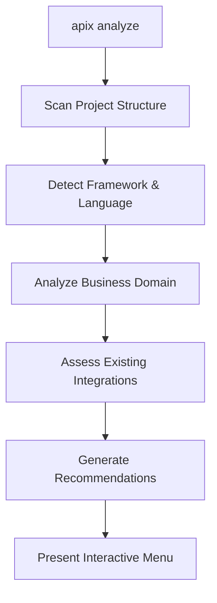
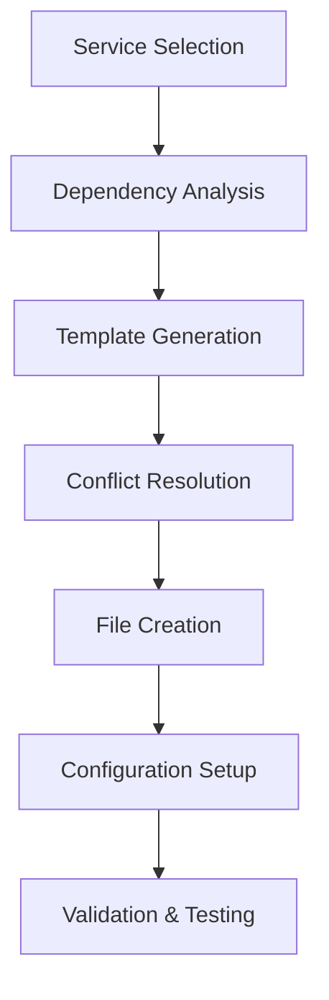
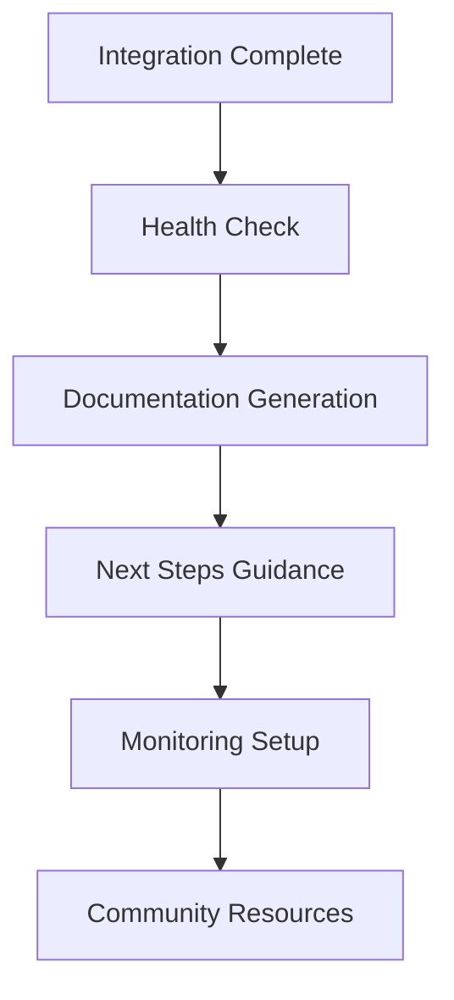

# APIX - AI-Powered Hedera Integration CLI

**From Hedera idea to working code in under 2 minutes.**

APIX is an intelligent CLI package that enables developers to instantly install and integrate the entire Hedera ecosystem into their projects. Built on proven modular architecture patterns and powered by the Hedera Agent Kit, APIX provides a seamless developer experience for blockchain integration.

## 🎯 Vision

APIX serves as the **universal gateway** to Hedera's comprehensive blockchain services, making enterprise-grade distributed ledger technology accessible to developers of all skill levels through intelligent automation and contextual guidance.

## 🚀 Quick Start

```bash
# Install APIX globally
npm install -g @hedera/apix

# Initialize APIX in your project
apix init

# Analyze your project for integration opportunities
apix analyze

# Add comprehensive Hedera services
apix add hts --name "MyToken" --symbol "MTK"
apix add smart-contract --type marketplace
apix add wallet --provider hashpack
apix add consensus --topic "project-updates"
```

## 📋 Core Features

### 🤖 AI-Powered Integration Analysis
- **Context-Aware Recommendations**: Analyzes your codebase to suggest optimal Hedera services
- **Framework Optimization**: Tailored integration strategies for Next.js, React, Node.js, and more
- **Business Domain Detection**: Identifies e-commerce, SaaS, DeFi patterns for targeted suggestions

### 🏗️ Comprehensive Hedera Service Coverage
- **Token Services (HTS)**: Fungible & Non-fungible tokens with custom fee schedules
- **Smart Contracts**: EVM-compatible and native Hedera contracts
- **Consensus Service (HCS)**: Topic-based messaging and data integrity
- **Account Management**: Multi-signature, threshold keys, auto-creation
- **File Storage**: Distributed file service integration
- **Staking & Rewards**: Network participation and reward mechanisms

### 🔧 Developer Experience
- **Zero-Config Setup**: Intelligent defaults with guided customization
- **Template Generation**: Production-ready code templates for all frameworks
- **Conflict Resolution**: Smart merging of existing codebases
- **Live Validation**: Real-time integration testing and health checks

### 🌐 Multi-Network Support
- **Testnet**: Development and testing environment
- **Mainnet**: Production deployments
- **Localnet**: Local development with Hedera Local Node

## 🏗️ Development Strategy

### 🎯 MVP-First Approach
**Philosophy**: Perfect execution over feature breadth. Build 90-second integrations that work flawlessly.

**Week 1 MVP Goal**: HTS + Wallet integration for Next.js/React with live demo capability
**Weeks 2-4 Goal**: Full-featured CLI covering entire Hedera ecosystem

---

## 📅 Phase 1: MVP Development (Week 1)

### **Day 1: Foundation** ✅ **DONE**
**Morning (4 hours):** ✅ **COMPLETED**
- ✅ CLI core with Commander.js + TypeScript  
- ✅ Basic project analysis (detect Next.js vs React)
- ✅ Configuration system (network selection, credentials)
- ✅ Template engine foundation (Handlebars)

**Afternoon (4 hours):** ✅ **COMPLETED**
- ✅ File generation system with conflict detection
- ✅ Basic error handling and validation
- ✅ Package.json modification utilities
- ✅ Environment file management (.env generation)

**Success Criteria:** ✅ `apix init` + `apix --help` working, framework detection

**Implementation Notes:**
- Complete CLI architecture with Commander.js
- Comprehensive project analysis engine with framework detection
- Advanced template system with Handlebars and conflict resolution
- Full configuration management with environment file generation
- Robust error handling system with user-friendly suggestions
- Package manager abstraction supporting npm/yarn/pnpm

### **Day 2: HTS Integration** 
**Morning (4 hours):**
- Hedera SDK wrapper for token operations
- HTS template generation for Next.js
- API route generation (`/api/tokens/*`)
- TypeScript definitions for tokens

**Afternoon (4 hours):**
- React components for token management
- Token creation, minting, transfer flows
- Error handling for Hedera operations
- Basic UI components (buttons, forms, status)

**Success Criteria:** `apix add hts` generates working token system

### **Day 3: Wallet Integration**
**Morning (4 hours):**
- HashPack wallet integration
- React context for wallet state
- Connection flow and modal components
- Account detection and switching

**Afternoon (4 hours):**
- Transaction signing abstraction
- Wallet + HTS integration (signed token operations)
- Connection state persistence
- Mobile-responsive wallet UI

**Success Criteria:** Complete wallet system with signed transactions

### **Day 4: Integration & Polish**
**Morning (4 hours):**
- Combined HTS + Wallet workflow testing
- Framework adaptation (Next.js + React compatibility)
- Template refinement and edge case handling
- Dependency management optimization

**Afternoon (4 hours):**
- CLI UX improvements (progress bars, success messages)
- Integration validation and health checks
- Generated code quality improvements
- Documentation generation

**Success Criteria:** End-to-end flow in under 90 seconds

### **Day 5: Demo Preparation**
**Target:** Consistent 60-90 second demo from install to live transaction
- Demo application setup and multiple scenarios
- Performance optimization and error recovery
- Video recordings and presentation materials

---

## 📅 Phase 2: Full Product (Weeks 2-4)

### **Week 2: Service Expansion**
- **Smart Contract Integration**: EVM deployment, ABI generation, gas optimization
- **Consensus Service (HCS)**: Topic creation, message streaming, mirror node queries  
- **Advanced Wallet Features**: Multi-wallet support, multi-signature templates

### **Week 3: Framework & AI Enhancement**
- **Framework Support**: Vue.js, Express.js, vanilla JavaScript adaptation
- **AI-Enhanced Features**: Business domain detection, smart recommendations
- **Developer Experience**: Interactive CLI, health monitoring, auto-testing

### **Week 4: Enterprise & Ecosystem** 
- **Enterprise Features**: Multi-sig accounts, compliance templates, team collaboration
- **Ecosystem Integration**: Mirror Node querying, oracle networks, deployment pipelines
- **Community Foundation**: Plugin system, documentation, contribution guidelines

## 🛠️ Technical Architecture

### Core Modules

#### 1. CLI Core (`src/cli/`)
- **Command Parser**: Intent recognition and validation
- **Interactive Prompts**: Guided setup and configuration
- **Progress Management**: Real-time operation feedback
- **Error Handling**: Graceful error recovery and suggestions

#### 2. Analysis Engine (`src/analysis/`)
- **Project Scanner**: Framework and pattern detection
- **Dependency Analyzer**: Existing integration assessment
- **Recommendation Engine**: AI-powered service suggestions
- **Compatibility Checker**: Version and conflict resolution

#### 3. Integration Planner (`src/planning/`)
- **Strategy Generator**: Multi-service integration orchestration
- **Dependency Resolution**: Service interaction mapping
- **Template Selection**: Context-aware code generation
- **Execution Planning**: Step-by-step implementation roadmap

#### 4. Hedera Services (`src/hedera/`)
```typescript
// Service-specific implementations
interface HederaServices {
  tokenService: HTSIntegration;
  consensusService: HCSIntegration;
  smartContractService: SCIntegration;
  accountService: AccountIntegration;
  fileService: FileIntegration;
  stakingService: StakingIntegration;
}
```

#### 5. Template Engine (`src/templates/`)
- **Framework Adapters**: Next.js, React, Vue, Express templates
- **Service Templates**: Pre-built integration components
- **Custom Generators**: AI-powered code creation
- **Validation Suite**: Quality and completeness checks

### Plugin Architecture

Following the Hedera Agent Kit plugin system:

```typescript
interface APIPXPlugin {
  name: string;
  version: string;
  description: string;
  services: HederaService[];
  templates: TemplateCollection;
  dependencies: Dependency[];
  install(context: ProjectContext): Promise<InstallResult>;
  configure(options: ConfigOptions): Promise<ConfigResult>;
  validate(project: Project): Promise<ValidationResult>;
}
```

## 🎛️ Configuration System

### Network Configuration
```yaml
# apix.config.yaml
networks:
  testnet:
    nodes:
      - "https://testnet.hedera.com:50211"
    mirror:
      - "https://testnet.mirrornode.hedera.com"
  mainnet:
    nodes:
      - "https://mainnet.hedera.com:50211"
    mirror:
      - "https://mainnet.mirrornode.hedera.com"

services:
  hts:
    defaultDecimals: 8
    autoAssociate: true
  hcs:
    defaultSubmitKey: true
    enableMirrorQuery: true
  smartContracts:
    defaultGasLimit: 300000
    optimizationLevel: "standard"
```

### Developer Preferences
```json
{
  "preferences": {
    "language": "typescript",
    "framework": "nextjs",
    "packageManager": "npm",
    "testingFramework": "jest",
    "deploymentStrategy": "vercel"
  },
  "integrations": {
    "wallet": {
      "providers": ["hashpack", "blade"],
      "connectionStrategy": "modal"
    },
    "tokens": {
      "defaultMetadataSchema": "opensea",
      "enableRoyalties": true
    }
  }
}
```

## 📊 Success Metrics

### Developer Experience Metrics
- **Time to First Integration**: < 2 minutes from `apix init` to working code
- **Code Quality Score**: > 85% on automated quality assessments  
- **Integration Success Rate**: > 95% successful deployments
- **Developer Satisfaction**: > 4.5/5 average rating

### Technical Metrics
- **Framework Coverage**: Support for 8+ major frameworks
- **Service Coverage**: 100% of core Hedera services
- **Template Accuracy**: < 5% manual modifications required
- **Performance**: CLI operations complete in < 30 seconds

## 🔄 Integration Workflow

### 1. Project Discovery


### 2. Service Integration


### 3. Post-Integration


## 📚 Learning Resources Integration

### Interactive Tutorials
- **Guided Workflows**: Step-by-step project setup
- **Best Practices**: Framework-specific optimization guides
- **Troubleshooting**: Common issues and solutions
- **Advanced Patterns**: Enterprise architecture examples

### Documentation Generation
```bash
# Auto-generated documentation
apix docs --generate
apix docs --deploy --platform vercel
```

## 🚀 Getting Started

### Prerequisites
- Node.js 18+ 
- npm/yarn/pnpm
- Git (for project initialization)

### Installation
```bash
# Global installation
npm install -g @hedera/apix

# Project-specific installation
npm install --save-dev @hedera/apix
```

### First Integration
```bash
# Initialize in your project
apix init

# Quick analysis and recommendations
apix analyze --verbose

# Add your first Hedera service
apix add hts --interactive
```

## 🤝 Contributing

APIX is built for the community by the community. See [CONTRIBUTING.md](./CONTRIBUTING.md) for details on:
- Development setup
- Plugin development
- Template contributions
- Testing guidelines
- Release process

## 📞 Support & Community

- **Discord**: [Join Hedera Discord](https://hedera.com/discord)
- **GitHub Issues**: Bug reports and feature requests
- **Documentation**: [docs.hedera.com](https://docs.hedera.com)
- **Examples**: [Hedera Code Repository](https://github.com/hashgraph)

---

**APIX transforms Hedera integration from days of research to minutes of execution.**

*Built with ❤️ for the Hedera developer community*


## 🎪 Demo Strategy

### **The 90-Second Demo Flow**

#### **Setup (15 seconds)**
```bash
cd my-nextjs-app
npm install -g @hedera/apix
apix init
```

#### **Integration (45 seconds)**
```bash
apix add hts --name "DemoToken" --symbol "DEMO"
apix add wallet --provider hashpack
npm run dev
```

#### **Live Demo (30 seconds)**
- Open localhost:3000 → Connect HashPack wallet
- Create Token → Live transaction on testnet  
- Mint Tokens → Tokens appear in account
- Show live transaction on HashScan

**Judge Impact:** 45 seconds from empty project to working blockchain app

---

## 📋 MVP Technical Stack

### **Core Architecture**
```
apix/
├── src/
│   ├── cli/           # Command interface
│   ├── analysis/      # Project detection (Next.js/React)
│   ├── templates/     # HTS + Wallet templates
│   ├── generation/    # File creation system
│   └── hedera/        # SDK wrapper (HTS + Accounts)
├── templates/
│   ├── nextjs/        # Next.js specific templates
│   ├── react/         # React specific templates
│   └── common/        # Shared components
└── examples/
    ├── nextjs-demo/   # Demo application
    └── react-demo/    # React demo
```

### **Generated MVP Files**
```
your-project/
├── .env.local                    # Hedera credentials
├── lib/hedera/
│   ├── client.ts                # Hedera client setup
│   ├── hts.ts                   # Token operations
│   └── wallet.ts                # Wallet utilities
├── components/hedera/
│   ├── WalletConnect.tsx        # Connection UI
│   ├── TokenManager.tsx         # Token operations UI
│   └── TransactionStatus.tsx    # Status feedback
├── contexts/
│   └── WalletContext.tsx        # Wallet state
├── hooks/
│   ├── useWallet.ts            # Wallet operations
│   └── useTokens.ts            # Token operations
├── api/tokens/ (Next.js only)
│   ├── create.ts               # Token creation endpoint
│   ├── mint.ts                 # Token minting endpoint
│   └── transfer.ts             # Transfer endpoint
└── types/
    └── hedera.ts               # TypeScript definitions
```

---

## 🚀 Ready to Start Development

The comprehensive plan above provides everything needed to build APIX from MVP to full product. The merged approach balances:

- **Strategic Vision**: Complete Hedera ecosystem coverage
- **Tactical Execution**: MVP-first development with daily milestones  
- **Technical Excellence**: Production-quality code generation
- **Developer Experience**: 90-second integrations that actually work
- **Market Timing**: Solves Hedera's #1 developer onboarding challenge

### Next Steps
1. **Phase 1 Kickoff**: Begin Day 1 foundation work
2. **Daily Standups**: Track progress against evening success criteria
3. **Demo Preparation**: Continuous integration testing for live demos
4. **Community Feedback**: Early user testing with Hedera developers

**The plan is comprehensive, actionable, and ready for immediate execution.**

---

**APIX transforms Hedera integration from days of research to minutes of execution.**

*Built with ❤️ for the Hedera developer community*
